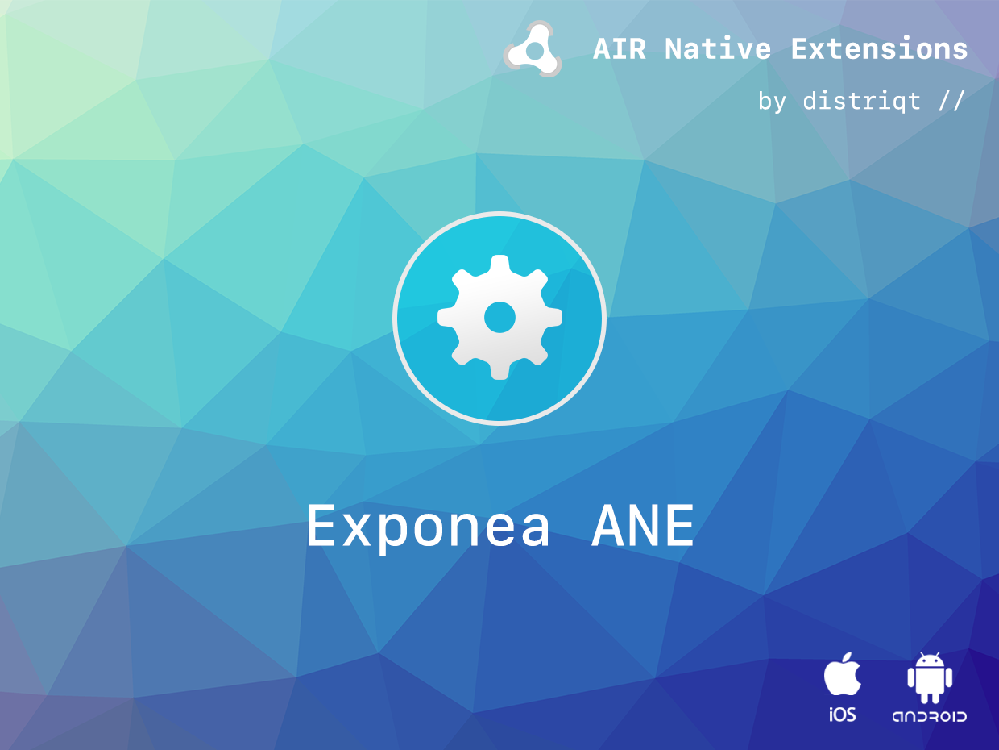

built by [distriqt //](https://airnativeextensions.com) 



# Exponea

Exponea is a custom built AIR Native Extension for a client to access the Exponea SDK.


### Features

- Initialise the Exponea SDK
- Identify and update users and properties
- Track events
- Track user sessions
- Single API interface - your code works across supported platforms with no modifications
- Sample project code and ASDocs reference


## Documentation

Quick Example: 

```actionscript
if (Exponea.isSupported)
{
    Exponea.instance.initialise( "AABBCCDDEEFFF", "https://api.exponea.com" );
    Exponea.instance.identify( "test@test.com" );

    Exponea.instance.track( "item_bought", { item_id: 45 } );
}
```


## Links

This extension is based on the Exponea SDK:

- https://github.com/exponea/exponea-ios
- https://github.com/exponea/exponea-android-sdk

It has been developed using the following custom fork of the SDK:

- https://github.com/Cellense/android-sdk 
- https://github.com/Cellense/exponea-ios


