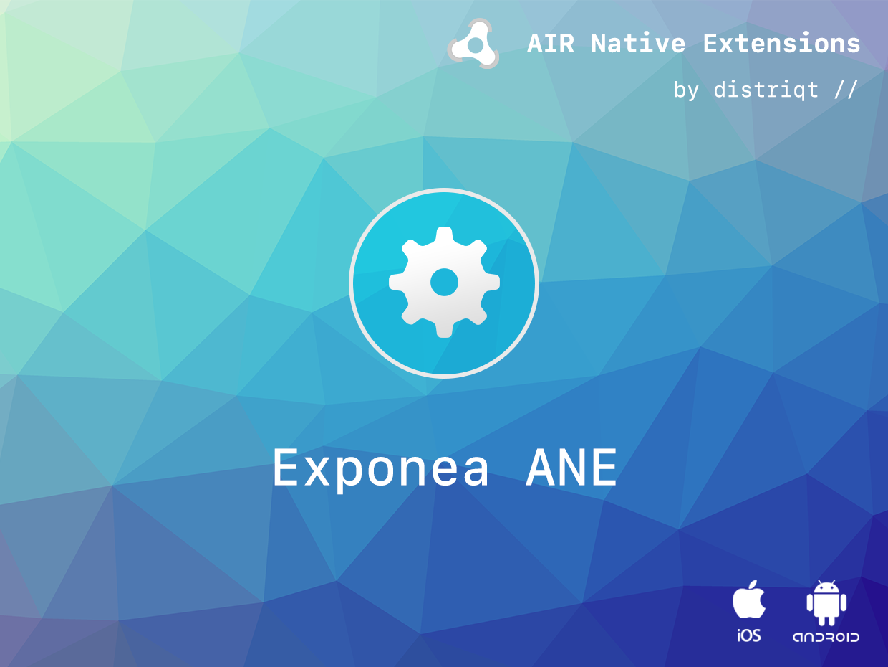

# Exponea

Exponea is an AIR Native Extension to access the Exponea SDK.

### Features

- Initialise the Exponea SDK
- Identify and update users and properties
- Track events
- Track user sessions
- Single API interface - your code works across supported platforms with no modifications
- Sample project code and ASDocs reference

This Wiki forms the best source of detailed documentation for the extension along with 
the asdocs.

